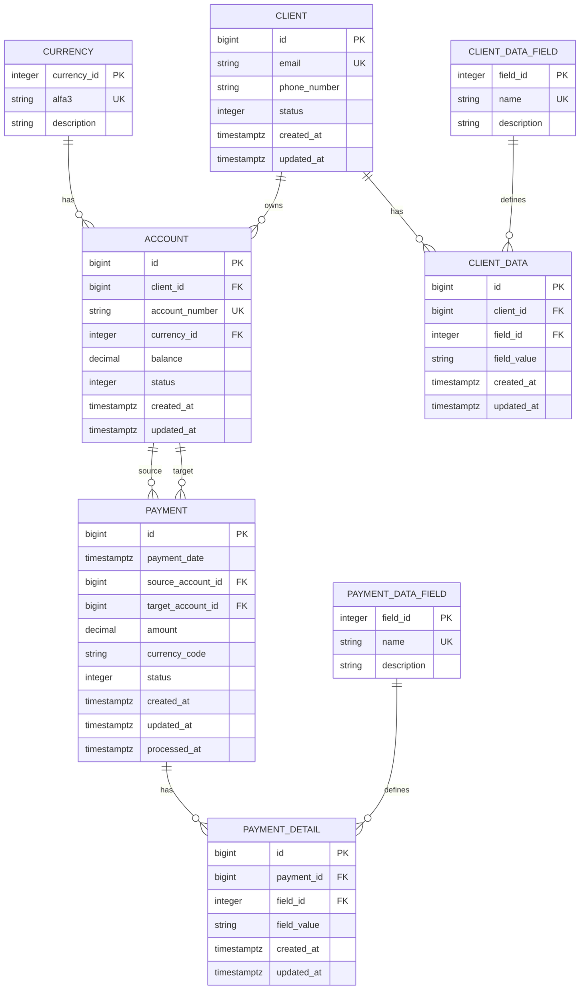

# Payment Processing System

Финальный проект курса **Java для разработчиков: Быстрый старт 🚀**.

## Описание проекта

Payment Processing System — это система обработки платежей, которая демонстрирует применение современных технологий Java/Spring для создания RESTful API.

## Технологический стек

- **Java 21**
- **Spring Boot 3.5.9**
- **Spring Data JPA + JDBC**
- **PostgreSQL 17**
- **Liquibase 5.0.1** (миграции БД)
- **Lombok**
- **SpringDoc OpenAPI 2.8.15** (документация API)
- **JUnit 5 + Mockito** (тестирование)
- **Maven** (сборка проекта)
- **Docker & Docker Compose** (развертывание)
- **SpotBugs** (анализ кода)
- **Checkstyle** (проверка стиля кода)

## ER-диаграмма базы данных



## Структура проекта

```
payment-processing-system/
├── src/
│   ├── main/
│   │   ├── java/ru/backendpro/
│   │   │   ├── config/           # Конфигурация
│   │   │   ├── controller/       # REST контроллеры
│   │   │   │   ├── dto/          # Data Transfer Objects
│   │   │   │   └── mapper/       # Мапперы для преобразования сущностей
│   │   │   ├── dao/              # Data Access Objects (JDBC)
│   │   │   ├── entity/           # JPA сущности
│   │   │   ├── exception/        # Обработка исключений
│   │   │   ├── service/          # Бизнес-логика
│   │   │   └── PaymentProcessingSystemApplication.java
│   │   └── resources/
│   │       ├── db/changelog/     # Liquibase миграции
│   │       ├── application.yml  # Конфигурация приложения
│   │       └── application-dev.yml
│   └── test/                     # Тесты
├── docker-compose.yml            # Docker Compose конфигурация
├── pom.xml                       # Maven конфигурация
└── requests.http                 # Примеры HTTP запросов
```

## Установка и запуск

### Предварительные требования

- JDK 21 или выше
- Maven 3.6+
- PostgreSQL 12+ (или Docker для использования docker-compose)

### Шаги установки

#### Вариант 1: Использование Docker Compose (рекомендуется)

1. **Клонируйте репозиторий:**
   ```bash
   git clone <repository-url>
   cd payment-processing-system
   ```

2. **Запустите базу данных и pgAdmin:**
   ```bash
   docker-compose up -d
   ```
   
   Это запустит:
   - PostgreSQL на порту `5450`
   - pgAdmin на порту `5055` (http://localhost:5055)
     - Email: `admin@payment.com`
     - Password: `admin`

3. **Соберите проект:**
   ```bash
   mvn clean install
   ```

4. **Запустите приложение:**
   ```bash
   mvn spring-boot:run
   ```

#### Вариант 2: Локальная установка PostgreSQL

1. **Клонируйте репозиторий:**
   ```bash
   git clone <repository-url>
   cd payment-processing-system
   ```

2. **Создайте базу данных PostgreSQL:**
   ```sql
   CREATE DATABASE payment_db;
   CREATE USER payment_user WITH PASSWORD 'payment_pass';
   GRANT ALL PRIVILEGES ON DATABASE payment_db TO payment_user;
   ```

3. **Настройте подключение к БД:**
   Отредактируйте `src/main/resources/application.yml`:
   ```yaml
   spring:
     datasource:
       url: jdbc:postgresql://localhost:5432/payment_db
       username: payment_user
       password: payment_pass
   ```

4. **Соберите проект:**
   ```bash
   mvn clean install
   ```

5. **Запустите приложение:**
   ```bash
   mvn spring-boot:run
   ```

Приложение будет доступно по адресу: `http://localhost:8080`

## API Документация

После запуска приложения Swagger UI доступен по адресу:
```
http://localhost:8080/swagger-ui.html
```

API документация в формате OpenAPI доступна по адресу:
```
http://localhost:8080/api-docs
```

### Основные эндпоинты

Все эндпоинты используют префикс `/api/v1/`.

#### Клиенты (Clients)
- `POST /api/v1/clients` — создать клиента
- `GET /api/v1/clients/{id}` — получить клиента по ID
- `PATCH /api/v1/clients/{id}` — обновить свойства клиента
- `PATCH /api/v1/clients/{id}/status` — обновить статус клиента
- `DELETE /api/v1/clients/{id}` — деактивировать клиента

#### Счета (Accounts)
- `POST /api/v1/accounts` — создать счет
- `GET /api/v1/accounts/{id}` — получить счет по ID
- `GET /api/v1/accounts/number/{accountNumber}` — получить счет по номеру
- `GET /api/v1/accounts/client/{clientId}` — получить счета клиента
- `PATCH /api/v1/accounts/{id}/status` — обновить статус счета

#### Платежи (Payments)
- `POST /api/v1/payments` — создать платеж
- `POST /api/v1/payments/{id}/cancel` — отменить платеж
- `GET /api/v1/payments/{id}` — получить платеж по ID
- `PATCH /api/v1/payments/{id}` — обновить свойства платежа (добавляет только новые свойства, существующие игнорируются)
- `GET /api/v1/payments/account/{accountNumber}` — получить платежи по номеру счета (с пагинацией)
  - Параметры: `page` (по умолчанию 0), `size` (по умолчанию 10), `sortBy` (по умолчанию "paymentDate"), `direction` (ASC/DESC)
- `GET /api/v1/payments/client/{clientId}` — получить платежи клиента (с пагинацией)
  - Параметры: `page`, `size`, `sortBy`, `direction`

#### Отчеты (Reports)
- `GET /api/v1/reports/payments/statistics/perid` — статистика по платежам за период
  - Параметры: `startDate`, `endDate` (формат ISO 8601, ZonedDateTime)
- `GET /api/v1/reports/payments/statistics/last-days` — статистика по платежам за последние N дней
  - Параметры: `days` (по умолчанию 30)
- `GET /api/v1/reports/payments/statistics/by-currency` — статистика по платежам, сгруппированная по валютам
  - Параметры: `startDate`, `endDate` (формат ISO 8601, ZonedDateTime)
- `GET /api/v1/reports/clients/statistics` — статистика по клиентам
- `GET /api/v1/reports/clients/top-by-payments` — топ N клиентов по объему платежей
  - Параметры: `limit` (по умолчанию 10), `startDate`, `endDate` (формат ISO 8601, ZonedDateTime)
- `GET /api/v1/reports/accounts/statistics` — статистика по счетам
- `GET /api/v1/reports/accounts/clients-summary` — сводка по счетам всех клиентов

### Статусы

#### Статусы платежей
- `0` — PENDING (ожидает обработки)
- `1` — COMPLETED (завершен)
- `2` — FAILED (ошибка)
- `3` — CANCELLED (отменен)

#### Статусы клиентов
- `0` — DEACTIVATED (деактивирован)
- `1` — ACTIVE (активен)
- `2` — BLOCKED (заблокирован)

#### Статусы счетов
- `0` — BLOCKED (заблокирован)
- `1` — ACTIVE (активен)

## Примеры использования

### Создание клиента

```bash
curl -X POST http://localhost:8080/api/v1/clients \
  -H "Content-Type: application/json" \
  -d '{
    "email": "john.doe@example.com",
    "phoneNumber": "+79001234567",
    "status": "ACTIVE",
    "properties": {
      "firstName": "John",
      "lastName": "Doe"
    }
  }'
```

### Обновление клиента

```bash
curl -X PATCH http://localhost:8080/api/v1/clients/1 \
  -H "Content-Type: application/json" \
  -d '{
    "properties": {
      "firstName": "Jane",
      "lastName": "Smith"
    }
  }'
```

### Создание счета

```bash
curl -X POST http://localhost:8080/api/v1/accounts \
  -H "Content-Type: application/json" \
  -d '{
    "clientId": 1,
    "currencyCode": "USD",
    "initialBalance": 1000.00
  }'
```

### Обновление статуса счета

```bash
curl -X PATCH http://localhost:8080/api/v1/accounts/1/status \
  -H "Content-Type: application/json" \
  -d '{
    "status": "BLOCKED"
  }'
```

### Создание платежа

```bash
curl -X POST http://localhost:8080/api/v1/payments \
  -H "Content-Type: application/json" \
  -d '{
    "sourceAccountNumber": "550e8400-e29b-41d4-a716-446655440001",
    "targetAccountNumber": "550e8400-e29b-41d4-a716-446655440003",
    "amount": 100.00,
    "currencyCode": "USD",
    "details": {
      "description": "Payment for services"
    }
  }'
```

### Обновление свойств платежа

```bash
curl -X PATCH http://localhost:8080/api/v1/payments/1 \
  -H "Content-Type: application/json" \
  -d '{
    "details": {
      "note": "Updated payment note",
      "ip": "192.168.1.1"
    }
  }'
```

Примечание: Если свойство уже существует в БД, оно будет проигнорировано. Добавляются только новые свойства.

### Получение платежей с пагинацией

```bash
curl "http://localhost:8080/api/v1/payments/account/550e8400-e29b-41d4-a716-446655440001?page=0&size=10&sortBy=paymentDate&direction=DESC"
```

### Получение статистики по платежам

```bash
curl "http://localhost:8080/api/v1/reports/payments/statistics/last-days?days=30"
```

Также можно использовать файл `requests.http` для тестирования API с помощью HTTP клиента.

## Тестирование

Запуск тестов:
```bash
mvn test
```

Запуск проверки качества кода (Checkstyle и SpotBugs):
```bash
mvn verify
```

## Liquibase миграции

Миграции применяются автоматически при запуске приложения.

Для отката миграций:
```bash
mvn liquibase:rollback -Dliquibase.rollbackCount=1
```

## Бизнес-логика

### Создание клиента
- Email должен быть уникальным
- Обязательные свойства: `firstName`, `lastName`
- Поддерживаются дополнительные свойства через объект `properties`
- При создании клиента автоматически создается счет в валюте RUB с нулевым балансом

### Создание счета
- Номер счета генерируется автоматически (UUID)
- У клиента может быть только один счет в каждой валюте
- Валюта должна существовать в справочнике валют
- Можно указать начальный баланс

### Управление статусом счета
- Статусы счета: `ACTIVE` (1, активный), `BLOCKED` (0, заблокирован)
- Статус можно изменить через endpoint `PATCH /api/v1/accounts/{id}/status`
- При попытке установить тот же статус возвращается ошибка

### Создание и обработка платежа
1. Создается платеж со статусом `PENDING` (0)
2. Платежи обрабатываются автоматически через планировщик задач (scheduled tasks)
3. При обработке:
   - Проверяется достаточность средств на счете отправителя
   - Проверяется статус счетов (должны быть ACTIVE)
   - Используется блокировка счетов для предотвращения race conditions
   - Списываются средства со счета отправителя
   - Зачисляются средства на счет получателя
   - Статус меняется на `COMPLETED` (1)
4. При ошибке статус меняется на `FAILED` (2)
5. Платеж можно отменить вручную (статус `CANCELLED` = 3)

### Обновление свойств платежа
- Свойства платежа можно обновить через endpoint `PATCH /api/v1/payments/{id}`
- Если свойство уже существует в БД, оно игнорируется (не обновляется)
- Если свойства нет в БД, оно добавляется
- Поддерживаемые свойства: `note`, `ip`, `clientSoftware`, `isCheckedFraud`

### Отчеты
- Все отчеты доступны через REST API
- Поддерживается фильтрация по периодам (даты в формате ISO 8601, ZonedDateTime)
- Статистика включает агрегированные данные по платежам, клиентам и счетам

## Дополнительная информация

### Структура пакетов
- `ru.backendpro.controller` — REST контроллеры, DTO и мапперы
- `ru.backendpro.service` — бизнес-логика
- `ru.backendpro.entity` — JPA сущности
- `ru.backendpro.dao` — JDBC DAO для сложных запросов и JPA репозитории
- `ru.backendpro.exception` — обработка исключений
- `ru.backendpro.config` — конфигурация приложения

### Особенности реализации
- Использование JPA для базовых операций и JDBC для сложных запросов
- Автоматическая обработка платежей через Spring Scheduling
- Блокировка счетов при обработке платежей для обеспечения консистентности
- Валидация данных через Bean Validation
- Централизованная обработка исключений через GlobalExceptionHandler

## Авторы

Проект разрабатывается в рамках курса **Java для разработчиков: Быстрый старт 🚀**.

**Автор:** Кивилев Денис  
**Online-школа:** [backend-pro.ru](https://backend-pro.ru)

## Лицензия

MIT License
